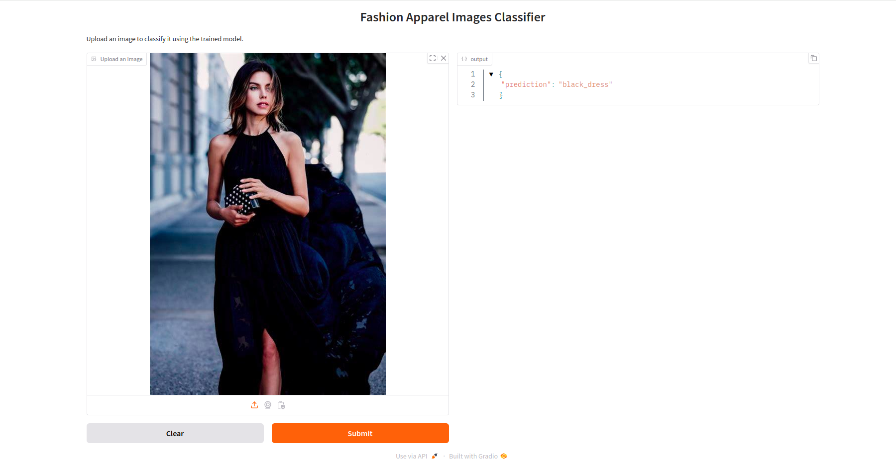

# Fashion Apparel Image Classification




## Problem Description

Fashion apparel classification refers to the task of identifying and categorizing different types of clothing or fashion items from images. With the rapid growth of e-commerce and fashion retail, it has become crucial to automatically categorize apparel to improve search, inventory management, and personalized recommendations. The goal of this project is to build a deep learning model capable of classifying fashion apparel from images into predefined categories, such as shirts, pants, shoes, dresses, and more.

Fashion apparel classification faces several challenges:

* Variety in Clothing: Clothes come in many different styles, colors, and textures, which makes it harder for the model to correctly classify them.
* Different Angles and Views: Clothes can be shown from different angles or may be partially covered, making it tricky for the model to identify them.
* Multiple Categories: There are many different types of clothing (e.g., shirts, pants, dresses), which requires the model to learn the differences between them.

This project aims to address these challenges by leveraging modern deep learning techniques, specifically convolutional neural networks (CNNs), to classify images into the appropriate apparel categories.

## Dataset Description

The Fashion Apparel Image Classification Dataset for Convolutional Neural Networks (CNN) is a carefully curated collection of clothing images, specifically designed for CNN-based image classification tasks. It features 5,413 high-quality images of various clothing items in two primary colors: black and blue. The dataset is categorized into 10 distinct classes, with a well-balanced distribution of images across categories:

* black_dress: 450 images
* black_pants: 871 images
* black_shirt: 715 images
* black_shoes: 766 images
* black_shorts: 328 images
* blue_dress: 502 images
* blue_pants: 798 images
* blue_shirt: 741 images
* blue_shoes: 523 images
* blue_shorts: 299 images

Each category contains a substantial number of images, ensuring a diverse and balanced dataset for robust model training and testing. The dataset showcases a wide variety of clothing styles, designs, and textures, making it an ideal resource for developing and refining CNN models for fashion apparel image classification.

You can find the dataset [here](https://www.kaggle.com/datasets/shreyanshverma27/new-data-fashion).

## Model Development

The model was developed using `Transfer Learning` with the `Xception` architecture and fine-tuned on custom-dataset. The training and experimentation were conducted on Kaggle's GPU environment to leverage its computational power. Below are the steps and experiments conducted during development:

### Parameter Tuning
To optimize the model, experimented with several hyperparameters on an input size of `150x150` and finalized the model training on an input size of `299x299` for better feature extraction.

* Learning Rate: Tuned values were 0.0001, 0.001, 0.01, and 0.1. Final: `0.001`.
* Hidden Layer Size: Experimented with 10, 100, and 1000. Final: `100`.
* Dropout Rate: Tested values were 0.0, 0.2, 0.5, and 0.8. Final: `0.5`.

### Data Augmentation
To enhance the robustness of the model and mitigate overfitting, data augmentation techniques were applied during training. These augmentations included:

* `Rotation`: Randomly rotating images within a range of 10 degrees.
* `Width Shift`: Horizontally shifting images by up to 10% of their width.
* `Height Shift`: Vertically shifting images by up to 10% of their height.
* `Shearing`: Applying a shear transformation up to 10%.
* `Zooming`: Zooming in/out within a range of 10%.
* `Horizontal Flip`: Flipping images horizontally at random.
* `Fill Mode`: Filling empty areas created by transformations using the nearest pixel values.

### Results
The final model achieved an impressive 95% accuracy on the test dataset, demonstrating its ability to classify fashion apparel images effectively.

### Full Experiment Details
All parameter tuning and experimentation details can be found in the [notebook.ipynb](./notebook.ipynb). The notebook provides code, results, and visualizations for every step of the development process.

## Installation

1. Clone the Repository
```bash
git clone https://github.com/zwe-htet-paing/fashion-apparel-image-classificaition.git
cd fashion-apparel-image-classificaition
```

2. Install Dependencies

* Install pipenv:
```bash
pip install pipenv
```

* Install required depencies:
```bash
pipenv install
```

## Run Locally

1. Start the Gradio UI:
```bash
pipenv run python predict.py
```

2. Open new terminal and run the test:
```bash
pipenv run python test.py
```

The UI will run locally on http://localhost:7860.

## Run on Docker

1. Build the Docker images:
```bash
docker build -t fashion-classification .
```

2. Run the Docker container:
```bash
docker run -it --rm -p 7860:7860 fashion-classification
```

3. Open the new terminal and run the test script:
```bash
pipenv run python test.py
```

The UI will accessable at http://0.0.0.0:7860.


## API Usage

You can access the Gradio API programmatically via Python:

### Python Example
```python
from gradio_client import Client, handle_file

image_url = '<IMAGE URL>'
client = Client("http://127.0.0.1:7860/")
result = client.predict(
		image=handle_file(image_url),
		api_name="/predict"
)
print(result)
```


### Example Input:

For testing, use the following image URL:

```python
image_url = "https://github.com/zwe-htet-paing/fashion-apparel-image-classificaition/blob/edd8d5b118da03a21d0b54f47174d88248fc1512/images/test_image.jpg?raw=true"
```

### Example Response

The response will look like:
```json
{
    'prediction': 'black_dress'
}
```

## Explanation
1. `Client`: The Gradio client is used to connect to the locally running Gradio API.
2. `handle_file`: Helps handle file paths or URLs before sending them to the API.
3. `predict`: This method interacts with the Gradio API endpoint defined by `api_name` (e.g., `"/predict"`).